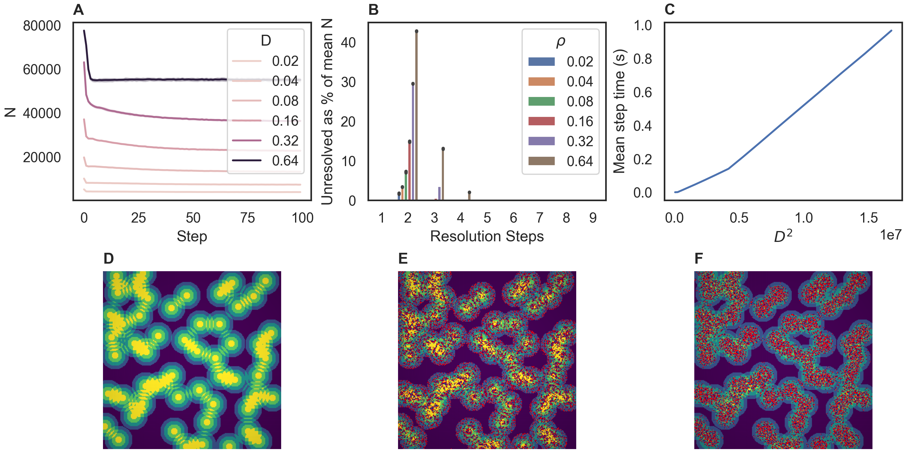

# FLAMEGPU2 Submodel Benchmark

This repository contains performance benchmarking of a [FLAME GPU 2](https://github.com/FLAMEGPU/FLAMEGPU2) implementation of a sugarscape model with instantaneous grow back. It is an example which shows how to use sub modelling to resolve competition within the model. In this case competition for movement to areas of high resource.

The code demonstrates the performance scaling of the benchmark when varying the world size.

## Benchmark Description and Results

A single experiment is undertaken within this benchmark. There is a range of raw data in the [`sample/data`](sample/data) directory with a description of the machine configurations used to generate it in each directory.

The results below are from the V100 runs on the Bessemer HPC system at the University of Sheffield. Job submission scripts are included in the [`scripts/slurm`](scripts/slurm) folder.

A combined figure for use in publication is shown below. For details please refer to the publication.

[](sample/figures/v100-470.82.01/alpha.2-v100-11.0-beltsoff/paper_figure.png)

### Performance scaling

This figure shows how the average simulation time scales the population size (i.e. the number of agents) contained within the model.

+ Population grid width is stepped between 64 and 4096 at intervals of 64
+ The initial probability of occupation is fixed at 0.17f
+ Simulation timing is measured over 100 steps


### Visualisation

In order to run the visualisation the model must be reconfigured using cmake with the `-DVISUALISATION` option. This will disable the performance scaling experiment so that visualisation is run with the following parameters. An example visualisation can be viewed on YouTube. 

[](https://youtu.be/tSLV19AWfwg)

## Building and Running the Benchmark

Detail of dependencies and the `cmake` build process are described in full in the [FLAMEGPU2-example-template Repo](https://github.com/FLAMEGPU/FLAMEGPU2-example-template) and are not repeated here. The benchmark should be built with seatbelts off (e.g. `-DFLAMEGPU_SEATBELTS=OFF` passed to the `cmake` configuration step) to disable additional run-time checks. E.g. for Volta (`SM_70`) GPUs under Linux.

```c
# Configure 
cmake . -B build -DCMAKE_BUILD_TYPE=Release -DFLAMEGPU_SEATBELTS=OFF -DCMAKE_CUDA_ARCHITECTURES=70
# Build
cmake --build build -j`nproc` 
```

### Execution and Data generation

```bash
cd build
./bin/Release/submodel-benchmark
```

This will produce a number of `.csv` files in the `build` directory.

Note: The `FLAMEGPU2_INC_DIR` environment variable may need to be set to `./_deps/flamegpu2-src/include/` for run-time compilation (RTC) to succeed if the source directory is not automatically found.

## Plotting Results

Individual figures can be generated from data in CSV files via a python script `plot.py`. Alternatively a combined figure used for publication can be produced using `plot_publication.py`.

### Dependencies

It is recommended to use python virtual environment or conda environment for plotting dependencies.

I.e. for Linux to install the dependencies into a python3 virtual environment and plot the results from all experiments output to the `build` directory.

```bash
# From the root of the repository
# Create the venv
python3 -m venv .venv
# Activate the venv
source .venv/bin/activate
# Install the dependencies via pip
python3 -m pip install -Ur requirements.txt
# Plot using csv files contained within the build directory
python3 plot.py build -o build/figures
# Use -h / --help for more information on optional plotting script parameters.
```

The sample figures were generated from the root directory using

```bash
python3 plot.py sample/data/v100-470.82.01/alpha.2-v100-11.0-beltsoff -o sample/figures/v100-470.82.01/alpha.2-v100-11.0-beltsoff
```

The publication figure was generated using:

```bash
python plot_publication.py -i sample/data/v100-470.82.01/alpha.2-v100-11.0-beltsoff -o sample/figures/v100-470.82.01/alpha.2-v100-11.0-beltsoff
```
