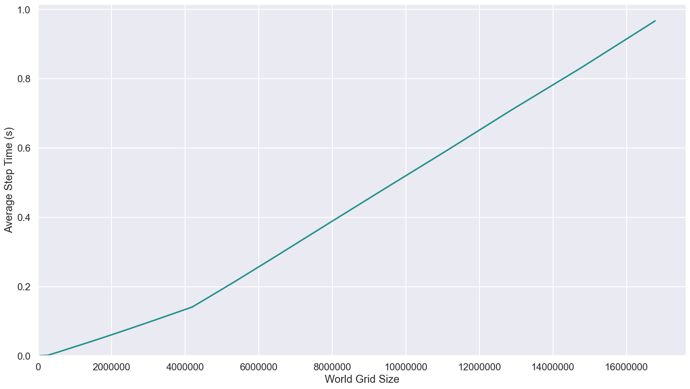
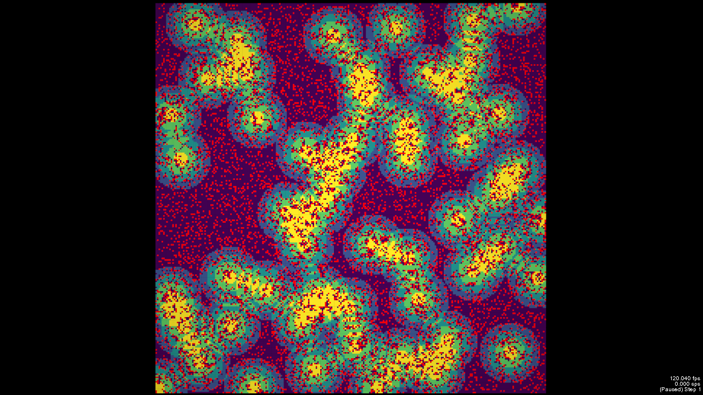

# FLAMEGPU2 Submodel Benchmark

This repository contains performance benchmarking of a [FLAME GPU 2](https://github.com/FLAMEGPU/FLAMEGPU2) implementation of a sugarscape model with instantaneous grow back. It is an exmaple which shows how to use sub modelling to resolve compentation within the model. In this case competition for movement to areas of high resource.

The code demonstrates the performance scaling of the model when varing the world size.


## Benchmark Description and Results

A single experiment is undertaken within this benchmark. There is a range of raw data in the [`sample/data`](sample/data) directory with a description of the machine configurations used to generate it in each directory.

The results below are from the V100 runs on the Bessemer HPC system at the University of Sheffield. Job submission scripts are included in the [`scripts/slurm`]() folder.

### Performance scaling

This figure shows how the average simulation time scales the population size (i.e. the number of agents) contained within the model.
	+ Population grid width is stepped between 64 and 4096 at intervals of 64
	+ The initial probability of occupation is fixed at 0.17f
	+ Simulation timing is measured over 100 steps
	


### Visualisation

In order to run the visualisation the model must be reconfigured using cmake with the `-DVISUALISATION` option. This will disable the performance scaling experiment so that visualisation is run with the following parameters. The following visualisation is obtained from the visualisation experiment at time step 0.



## Building and Running the Benchmark

Detail of dependencies and the `cmake` build process are described in full in the [FLAMEGPU2-example-template Repo](https://github.com/FLAMEGPU/FLAMEGPU2-example-template) and are not repeated here. The benchmark should be built with seatbelts off (e.g. `-DSEATBELTS=OFF` passed to the `cmake` configuration step) to disable additional run-time checks and optionally disabling Python Swig support which is not needed for this model(-DBUILD_SWIG_PYTHON=OFF ). E.g. for Volta (`SM_70`) GPUs under Linux.

```bash
# Configure 
cmake . -B build -DCMAKE_BUILD_TYPE=Release -DSEATBELTS=OFF -DBUILD_SWIG_PYTHON=OFF -DCUDA_ARCH=70
cmake --build build -j`nproc` 
make
```

### Execution and Data generation

The `FLAMEGPU2_INC_DIR` environment variable must be set for run-time compilation (TRC) to succeed. This can be done at the same time as execution of the model. E.g. 

```bash
cd build
FLAMEGPU2_INC_DIR=./_deps/flamegpu2-src/include/ ./bin/Release/submodel-benchmark 
```

This will produce 6 `.csv` files in the `build` directory.

## Plotting Results

### Dependencies


Figures can be generated from data in CSV files via a python script.

It is recommended to use python virtual environment or conda environment for plotting dependencies.

I.e. for linux to install the dependencies into a python3 virtual environment and plot the data within `build/performance_scaling.csv`

```bash
# From the root of the repository
# Create the venv
python3 -m venv .venv
# Activate the venv
source .venv/bin/activate
# Install the dependencies via pip
python3 -m pip install -Ur requirements.txt
# Plot using csv files contained within the build directory
python3 plot.py build -o build/figures
# Use -h / --help for more information on optional plotting script parameters.
```

The sample figures were generated from the root directory using

```bash
python3 plot.py sample/data/v100-470.82.01/alpha.2-v100-11.0-beltsoff -o sample/data-figures/v100-470.82.01/alpha.2-v100-11.0-beltsoff
```